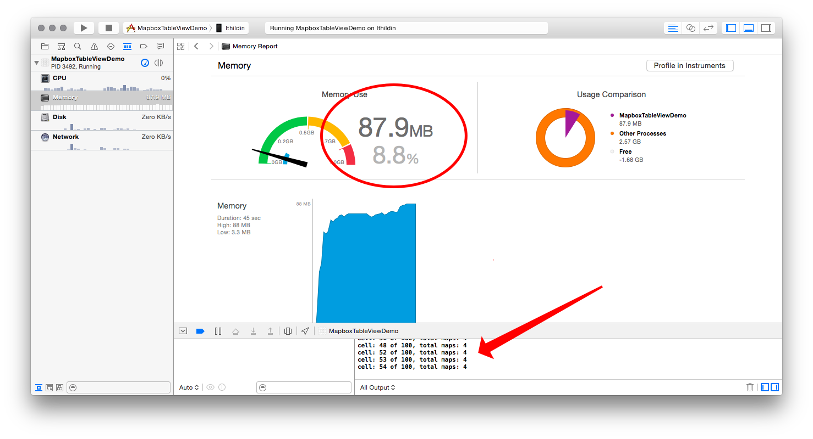

# MapboxTableViewDemo

Reference implementation of reuse of `UITableViewCell` objects containing Mapbox GL-based [Mapbox iOS SDK](https://www.mapbox.com/ios-sdk/) maps. 

## Install

1. Get [CocoaPods](http://cocoapods.org)
1. `pod install`
1. `open MapboxTableViewDemo.xcworkspace`
1. Build & Run

## Notes

- Creates a `UITableView` with 100 rows.
- Only creates 4-6 `MGLMapView` Open GL-backed map views (depending on device size).
- Loads a different center coordinate for each of the 100 rows.
- Performant on device (tested with an iPhone 5s running iOS 8.4.1).
- Data courtesy [`geoiq/gc_data`](https://github.com/geoiq/gc_data/blob/master/datasets/10.geojson).

